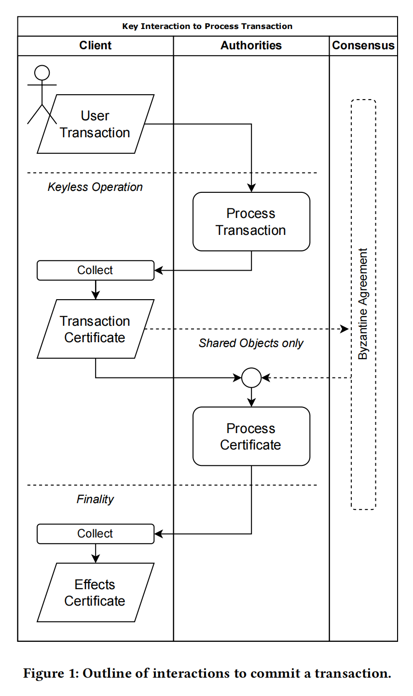

The Sui Smart Contracts Platform(Sui 智能合约平台)--中文白皮书
The MystenLabs Team
hello@mystenlabs.com

#1 INTRODUCTION(简介)
Sui is a decentralized permissionless smart contract platform biased towards low-latency management of assets. It uses the Move programming language to define assets as objects that may be owned by an address. Move programs define operations on these typed objects including custom rules for their creation, the transfer of these assets to new owners, and operations that mutate assets.
Sui 是一个去中心化的无许可智能合约平台，偏向于资产的低延迟管理。它使用 Move 编程语言将资产定义为地址可能拥有的对象。Move 程序定义了对这些类型化对象的操作，包括创建它们的自定义规则、将这些资产转移给新所有者以及改变资产的操作。

Sui is maintained by a permissionless set of authorities that play a role similar to validators or miners in other blockchain systems. It uses a Byzantine consistent broadcast protocol between authorities to ensure the safety of common operations on assets, ensuring lower latency and better scalability as compared to Byzantine agreement. It only relies on Byzantine agreement for the safety of shared objects. As well as governance operations and check-pointing, performed off the critical latency path. Execution of smart contracts is also naturally parallelized when possible. Sui supports light clients that can authenticate reads as well as full clients that may audit all transitions for integrity. These facilities allow for trust-minimized bridges to other blockchains.
Sui 由一组未经许可的权威机构维护，这些权威机构扮演着类似于其他区块链系统中的验证者或矿工的角色。它使用权威机构之间的拜占庭一致性广播协议来确保资产通用操作的安全性，与拜占庭协议相比确保更低的延迟和更好的可扩展性。它仅依赖拜占庭协议来确保共享对象的安全。以及治理操作和检查点，在关键延迟路径之外执行。在可能的情况下，智能合约的执行也会自然并行。 Sui 支持可以验证读取的轻客户端以及可以审计所有转换完整性的完整客户端。这些设施允许与其他区块链建立信任最小化的桥梁。

A native asset SUI is used to pay for gas for all operations. It is also used by its owners to delegate stake to authorities to operate Sui within epochs, and periodically, authorities are reconfigured according to the stake delegated to them. Used gas is distributed to authorities and their delegates according to their stake and their contribution to the operation of Sui.
原生资产 SUI 用于支付所有操作的 gas。它的所有者也使用它来将股份委托给当局以在世代内操作 Sui，并且定期地根据委托给他们的股份重新配置验证人。用过的gas根据他们的股份和他们对 Sui 运营的贡献分配给验证人和他们的代表。

This whitepaper is organized in two parts, with Sect. 2 describing the Sui programming model using the Move language, and Sect. 4 describing the operations of the permissionless decentralized system that ensures safety, liveness and performance for Sui.
本白皮书分为两部分，第2部分 使用 Move 语言描述 Sui 编程模型。 第4部分 描述了无需许可的去中心化系统的操作，以确保 Sui 的安全性、活跃性和性能。

#2 SUI SMART CONTRACT PROGRAMMING(SUI 智能合约编程)
Sui smart contracts are written in the Move[4] language. Move is safe and expressive, and its type system and data model naturally support the parallel agreement/execution strategies that make Sui scalable. Move is an open-source programming language for building smart contracts originally developed at Facebook for the Diem blockchain. The language is platform-agnostic, and in addition to being adopted by Sui, it has been gaining popularity on other platforms (e.g., 0L, StarCoin).
Sui 智能合约是用 Move[4] 语言编写的。 Move 安全且富有表现力，其类型系统和数据模型自然支持使 Sui 具有可扩展性的并行协议/执行策略。 Move 是一种开源编程语言，最初由 Facebook 为 Diem 区块链开发的智能合约。该语言与平台无关，除了被 Sui 采用外，它在其他平台（例如 0L、StarCoin）上也越来越受欢迎。

In this section we will discuss the main features of the Move language and explain how it is used to create and manage assets on Sui. A more thorough explanation of Move’s features can be found in the Move Programming Language book and more Sui-specific Move content can be found in the Sui Developer Portal , and a more formal description of Move in the context of Sui can be found in Section 3.
在本节中，我们将讨论 Move 语言的主要特性，并解释如何使用它在 Sui 上创建和管理资产。可以在 Move Programming Language 书中找到对 Move 功能的更详尽解释，可以在 Sui 开发人员门户中找到更多特定于 Sui 的 Move 内容，可以在第 3 节中找到 Sui 上下文中对 Move 的更正式描述.

##2.1 Overview(概述)
Sui’s global state includes a pool of programmable objects created and managed by Move packages that are collections of Move modules (see Section 2.1.1 for details) containing Move functions and types. Move packages themselves are also objects. Thus, Sui objects can be partitioned into two categories:
Sui 的全局状态包括由 Move 包创建和管理的可编程对象池，这些对象是包含 Move 函数和类型的 Move 模块的集合（详见第 2.1.1 节）。Move 包本身也是对象。因此，Sui 对象可以分为两类：

• Struct data values: Typed data governed by Move modules. Each object is a struct value with fields that can contain primitive types (e.g. integers, addresses), other objects, and non-object structs.
• 结构数据值：由Move模块管理的类型化数据。每个对象都是一个结构值，其字段可以包含基本类型（例如整数、地址）、其他对象和非对象结构。

• Package code values: a set of related Move bytecode modules published as an atomic unit. Each module in a package can depend both on other modules in that package and on modules in previously published packages.
• 包代码值：一组作为原子单元发布的相关Move字节码模块。包中的每个模块既可以依赖于该包中的其他模块，也可以依赖于先前发布的包中的模块。

Objects can encode assets (e.g., fungible or non-fungible tokens), capabilities granting the permission to call certain functions or create other objects, “smart contracts” that manage other assets, and so on–it’s up to the programmer to decide. The Move code to declare a custom Sui object type looks like this:
对象可以编码资产（例如，可替代或不可替代的代币）、授予调用某些函数或创建其他对象的权限的能力、管理其他资产的“智能合约”等等——这由程序员决定。声明自定义 Sui 对象类型的 Move 代码如下所示：

```go
struct Obj has key {
    id: VersionedID, // globally unique ID and version（全球唯一 ID 和版本）
    f: u64 // objects can have primitive fields（对象可以有原始字段）
    g: OtherObj // fields can also store other objects（字段还可以存储其他对象）
}
```

All structs representing Sui objects (but not all Move struct values) must have the id field and the key ability indicating that the value can be stored in Sui’s global object pool.
所有表示 Sui 对象的结构（但不是所有 Move 结构值）都必须具有 id 字段和指示该值可以存储在 Sui 的全局对象池中的键能力。

###2.1.1 Modules(模块)
A Move program is organized as a set of modules, each consisting of a list of struct declarations and function declarations. A module can import struct types from other modules and invoke functions declared by other modules.
Move 程序被组织为一组模块，每个模块由一系列结构声明和函数声明组成。一个模块可以从其他模块导入结构类型并调用其他模块声明的函数。

Values declared in one Move module can flow into another e.g., module OtherObj in the example above could be defined in a different module than the module defining Obj. This is different from most smart contract languages, which allow only unstructured bytes to flow across contract boundaries. However, Move is able to support this because it provides encapsulation features to help programmers write robustly safe code. Specifically, Move’s type system ensures that a type like Obj above can only be created, destroyed, copied, read, and written by functions inside the module that declares the type. This allows a module to enforce strong invariants on its declared types that continue to hold even when they flow across smart contract trust boundaries.
在一个 Move 模块中声明的值可以流入另一个模块，例如，上面示例中的模块 OtherObj 可以在与定义 Obj 的模块不同的模块中定义。这与大多数智能合约语言不同，后者只允许非结构化字节流过合约边界。但是，Move 能够支持这一点，因为它提供了封装功能来帮助程序员编写稳健安全的代码。具体来说，Move 的类型系统确保像上面的 Obj 这样的类型只能由声明该类型的模块内部的函数创建、销毁、复制、读取和写入。这允许模块对其声明的类型强制执行强不变性，即使它们流过智能合约信任边界，这些类型也会继续保持不变。

###2.1.2 Transactions and Entrypoints(交易和入口点)
The global object pool is updated via transactions that can create, destroy, read, and write objects. A transaction must take each existing object it wishes to operate on as an input. In addition, a transaction must include the versioned ID of a package object, the name of a module and function inside that package, and arguments to the function (including input objects). For example, to call the function
全局对象池通过可以创建、销毁、读取和写入对象的交易进行更新。事务必须将它希望操作的每个现有对象作为输入。此外，一个交易必须包含包对象的版本 ID、包内模块和函数的名称以及函数的参数（包括输入对象）。例如调用函数

```
public fun entrypoint(
o1: Obj, o2: &mut Obj, o3: &Obj, x: u64, ctx: &mut TxContext
) { ... }
```

a transaction must supply ID’s for three distinct objects whose type is Obj and an integer to bind to x. The TxContext is a special parameter filled in by the runtime that contains the sender address and information required to create new objects.
交易必须为类型为 Obj 的三个不同对象提供 ID，并提供一个绑定到 x 的整数。 TxContext 是运行时填充的特殊参数，包含发送者地址和创建新对象所需的信息。

Inputs to an entrypoint (and more generally, to any Move function) can be passed with different mutability permissions encoded in the type. An Obj input can be read, written, transferred, or destroyed. A &mut Obj input can only be read or written, and a &Obj can only be read. The transaction sender must be authorized to use each of the input objects with the specified mutability permissions– see Section 4.4 for more detail.
可以使用在类型中编码的不同可变性权限来传递对入口点（更一般地说，对任何 Move 函数）的输入。可以读取、写入、传输或销毁 Obj 输入。 &mut Obj 输入只能读或写，&Obj 只能读。交易发送者必须被授权使用每个具有指定可变性权限的输入对象——更多细节请参见第 4.4 节。

###2.1.3 Creating and Transferring Objects(创建和传输对象) 
Programmers can create objects by using the TxContext passed into the entrypoint to generate a fresh ID for the object:
程序员可以通过使用传递到入口点的 TxContext 为对象生成新的 ID 来创建对象：

```
public fun create_then_transfer(
f: u64, g: OtherObj, o1: Obj, ctx: &mut TxContext
) {
    let o2 = Obj { id: TxContext::fresh_id(ctx), f, g };
    Transfer::transfer(o1, TxContext:sender());
    Transfer::transfer(o2, TxContext:sender());
}
```

This code takes two objects of type OtherObj and Obj as input, uses the first one and the generated ID to create a new Obj, and then transfers both Obj objects to the transaction sender. Once an object has been transferred, it flows into the global object pool and cannot be accessed by code in the remainder of the transaction. The Transfer module is part of the Sui standard library, which includes functions for transferring objects to user addresses and to other objects.
此代码将两个类型为 OtherObj 和 Obj 的对象作为输入，使用第一个和生成的 ID 创建一个新的 Obj，然后将这两个 Obj 对象传输给交易发送方。一旦一个对象被转移，它就会流入全局对象池，并且在交易的其余部分不能被代码访问。 Transfer 模块是 Sui 标准库的一部分，其中包括将对象传输到用户地址和其他对象的函数。

We note that if the programmer code neglected to include one of the transfer calls, this code would be rejected by the Move type system. Move enforces resource safety protections to ensure that objects cannot be created without permission, copied, or accidentally destroyed. Another example of resource safety would be an attempt to transfer the same object twice, which would also be rejected by the Move type system.
我们注意到，如果程序员代码忽略了其中一个传输调用，则该代码将被 Move 类型系统拒绝。 Move 强制执行资源安全保护，以确保对象不会在未经许可的情况下创建、复制或意外销毁。资源安全的另一个例子是尝试传输同一个对象两次，这也会被 Move 类型系统拒绝。

#3 THE SUI PROGRAMMING MODEL(SUI 编程模型)

In this section, we expand on the informal description of the Sui programming model from Section 2 by presenting detailed semantic definitions. The previous section showed examples of Move source code; here we define the structure of Move bytecode. Developers write, test, and formally verify Move source code locally, then compile it to Move bytecode before publishing it to the blockchain. Any Move bytecode be published on-chain must pass through a bytecode verifier to ensure that it satisfies key properties such as type, memory, and resource safety.
在本节中，我们通过提供详细的语义定义来扩展第 2 节中对 Sui 编程模型的非正式描述。上一节展示了 Move 源代码的示例；这里我们定义了 Move 字节码的结构。开发人员在本地编写、测试和正式验证 Move 源代码，然后在将其发布到区块链之前将其编译为 Move 字节码。任何在链上发布的 Move 字节码都必须通过字节码验证器，以确保其满足类型、内存和资源安全等关键属性。

As mentioned in Section 2, Move is a platform-agnostic language which can be adapted to fit specific needs of different systems without forking the core language. In the following description, we define both concepts from core Move language (denoted in black text) and Sui-specific features extending the core Move language(denoted with orange text).
如第 2 节所述，Move 是一种与平台无关的语言，无需分叉核心语言即可适应不同系统的特定需求。在下面的描述中，我们定义了核心 Move 语言的概念（用黑色文本表示）和扩展核心 Move 语言的特定于 Sui 的功能（用橙色文本表示）。

Module       = ModuleName× (StructName ⇀ StructDecl)×(FunName ⇀ FunDecl) × <font color=#FFA500>FunDecl</font>
GenericParam = [Ability]
StructDecl   = (FieldName ⇀ StorableType)×[Ability] × [GenericParam]
FunDecl      = [Type] [Type] × [Instr] × [GenericParam]
Instr        = <font color=#FFA500>TransferToAddr | TransferToObj | ShareMut | ShareImmut | ... </font>

Table 1: Module

Move code is organized into modules whose structure is defined in Table 1. A module consists of a collection of named struct declarations and a collection of named function declarations (examples of these declaration are provided in Section 2.1). A module also contains a special function declaration serving as the module initializer. This function is invoked exactly once at the time the module is published on-chain.
Move 代码被组织成模块，其结构在表 1 中定义。模块由一组命名结构声明和一组命名函数声明组成（这些声明的示例在第 2.1 节中提供）。模块还包含用作模块初始值设定项的特殊函数声明。该函数在模块发布到链上时被调用一次。

A struct declaration is a collection of named fields, where a field name is mapped to a storeable type. Its declaration also includes an optional list of abilities (see Section 2 for a description of storeable types and abilities). A struct declaration may also include a list of generic parameters with ability constraints, in which case we call it a generic struct declaration, for example struct Wrapper<T: copy>{ t: T }. A generic parameter represents a type to be used when declaring struct fields – it is unknown at the time of struct declaration, with a concrete type provided when the struct is instantiated(i.e., as struct value is created).
结构声明是命名字段的集合，其中字段名称映射到可存储类型。它的声明还包括一个可选的能力列表（有关可存储类型和能力的描述，请参阅第 2 节）。结构声明还可以包括具有能力约束的泛型参数列表，在这种情况下我们称其为泛型结构声明，例如 struct Wrapper<T: copy>{ t: T }。泛型参数表示在声明结构字段时要使用的类型——在结构声明时它是未知的，具体类型在结构被实例化时提供（即，作为结构值被创建）。

A function declaration includes a list of parameter types, a list of return types, and a list of instructions forming the function’s body.
函数声明包括参数类型列表、返回类型列表和构成函数主体的指令列表。
A function declaration may also include a list of generic parameters with ability constraints, in which case we call it a generic function declaration, for example fun unwrap<T: copy>(p: Wrapper<T>){}.
一个函数声明也可能包括一个带有能力约束的泛型参数列表，在这种情况下我们称它为泛型函数声明，例如 fun unwrap<T: copy>(p: Wrapper<T>){}。
Similarly to struct declarations, a generic parameter represents a type unknown at function declaration time, but which is nevertheless used when declaring function parameters, return values and a function body (concrete type is provided when a function is called).
与结构声明类似，泛型参数表示函数声明时未知的类型，但在声明函数参数、返回值和函数体时仍会使用它（调用函数时提供具体类型）。

Instructions that can appear in a function body include all ordinary Move instructions with the exception of global storage instructions (e.g., move_to, move_from, borrow_global).
可以出现在函数体中的指令包括除全局存储指令（例如 move_to、move_from、borrow_global）之外的所有普通 Move 指令。
See [14] for a complete list of core Move’s instructions and their semantics. In Sui persistent storage is supported via Sui’s global object pool rather than the account-based global storage of core Move.
有关核心 Move 指令及其语义的完整列表，请参见 [14]。在 Sui 中，持久存储是通过 Sui 的全局对象池而不是核心 Move 的基于帐户的全局存储来支持的。

There are four Sui-specific object operations. Each of these operations changes the ownership metadata of the object (see Section 3.3) and returns it to the global object pool. Most simply, a Sui object can be transferred to the address of a Sui end-user.
有四个特定于 Sui 的对象操作。这些操作中的每一个都会更改对象的所有权元数据（请参阅第 3.3 节）并将其返回到全局对象池。最简单的是，可以将 Sui 对象传输到 Sui 最终用户的地址。
An object can also be transferred to another parent object–this operation requires the caller to supply a mutable reference to the parent object in addition to the child object.
一个对象也可以转移到另一个父对象——这个操作需要调用者除了子对象之外还提供一个对父对象的可变引用。
An object can be mutably shared so it can be read/written by anyone in the Sui system. Finally, an object can be immutably shared so it can be read by anyone in the Sui system, but not written by anyone.
一个对象可以可变共享，因此它可以被 Sui 系统中的任何人读/写。最后，一个对象可以被不可变地共享，所以它可以被 Sui 系统中的任何人读取，但不能被任何人写入。

The ability to distinguish between different kinds of ownership is a unique feature of Sui. In other blockchain platforms we are aware of, every contract and object is mutably shared. As we will explain in Section 4, Sui leverages this information for parallel transaction execution (for all transactions) and parallel agreement(for transactions involving objects without shared mutability).
区分不同所有制的能力是Sui的一个独特之处。在我们知道的其他区块链平台中，每个合约和对象都是可变共享的。正如我们将在第 4 节中解释的那样，Sui 利用此信息进行并行事务执行（对于所有事务）和并行协议（对于涉及没有共享可变性的对象的交易）。

##3.2 Types and Abilities(类型和能力)

PrimType       = {address, id, bool, u8, u64, . . .}
StructType     = ModuleName × StructName× [StorableType]
StorableType   = PrimType ⊎ StructType ⊎ GenericType ⊎ VectorType
VectorType     = StorableType
GenericType    = N
MutabilityQual = {mut, immut}
ReferenceType  = StorableType × MutabilityQual
Type           = ReferenceType ⊎ StorableType
Ability        = {key, store, copy, drop}

Table 2: Types and Abilities

A Move program manipulates both data stored in Sui global object pool and transient data created when the Move program executes.
Move 程序操作存储在 Sui 全局对象池中的数据和 Move 程序执行时创建的瞬态数据。
Both objects and transient data are Move values at the language level.
对象和瞬态数据都是语言级别的 Move 值。
However, not all values are created equal – they may have different properties and different structure as prescribed by their types.
然而，并非所有的值都是平等的——它们可能具有不同的属性和不同的结构，正如它们的类型所规定的那样。

The types used in Move are defined in Table 2. Move supports many of the same primitive types supported in other programming languages, such as a boolean type or unsigned integer types of various sizes. In addition, core Move has an address type representing an end-user in the system that is also used to identify the sender of a transaction and (in Sui) the owner of an object. Finally, Sui defines an id type representing an identity of a Sui object– see Section 3.3 for details.
Move 中使用的类型在表 2 中定义。Move 支持其他编程语言支持的许多相同的原始类型，例如布尔类型或各种大小的无符号整数类型。此外，核心 Move 具有代表系统中最终用户的地址类型，该地址类型也用于识别交易的发送者和（在 Sui 中）对象的所有者。最后，Sui 定义了一个 id 类型，表示 Sui 对象的身份——详情请参阅第 3.3 节。

A struct type describes an instance (i.e., a value) of a struct declared in a given module (see Section 3.1 for information on struct declarations).
结构类型描述了在给定模块中声明的结构的实例（即值）（有关结构声明的信息，请参阅第 3.1 节）。
A struct type representing a generic struct declaration (i.e., generic struct type) includes a list of storeable types – this list is the counterpart of the generic parameter list in the struct declaration. A storeable type can be either a concrete type (a primitive or a struct) or a generic type. We call such types storeable because they can appear as fields of structs and in objects stored persistently on-chain, whereas reference types cannot.
表示通用结构声明（即通用结构类型）的结构类型包括一个可存储类型列表——该列表是结构声明中通用参数列表的对应部分。可存储类型可以是具体类型（原始类型或结构）或泛型类型。我们称这种类型为可存储的，因为它们可以作为结构的字段出现，也可以出现在链上持久存储的对象中，而引用类型则不能。

For example, the Wrapper<u64> struct type is a generic struct type parameterized with a concrete (primitive) storeable type u64 – this kind of type can be used to create a struct instance (i.e.,value).
例如，Wrapper<u64> 结构类型是用具体（原始）可存储类型 u64 参数化的通用结构类型——这种类型可用于创建结构实例（即值）。
On the other hand, the same generic struct type can be parameterized with a generic type (e.g., struct Parent<T> { w: Wrapper<T> }) coming from a generic parameter of the enclosing struct or function declaration – this kind of type can be used to declare struct fields, function params, etc. Structurally, a generic type is an integer index(defined as N in Table 5) into the list of generic parameters in the enclosing struct or function declaration.
另一方面，相同的泛型结构类型可以用来自封闭结构或函数声明的泛型参数的泛型类型（例如，struct Parent<T> { w: Wrapper<T> }）进行参数化——这种type 可用于声明结构字段、函数参数等。在结构上，泛型类型是一个整数索引（在表 5 中定义为 N）到封闭结构或函数声明中的泛型参数列表中。

A vector type in Move describes a variable length collection of homogenous values. A Move vector can only contain storeable types, and it is also a storeable type itself.
Move 中的向量类型描述了同质值的可变长度集合。 Move 向量只能包含可存储类型，并且它本身也是可存储类型。

A Move program can operate directly on values or access them indirectly via references. A reference type includes both the storeable type referenced and a mutability qualifier used to determine (and enforce) whether a value of a given type can be read and written(mut) or only read (immut). Consequently, the most general form of a Move value type (Type in Table 2) can be either a storeable type or a reference type.
Move 程序可以直接对值进行操作或通过引用间接访问它们。引用类型包括所引用的可存储类型和用于确定（和强制执行）给定类型的值是可读可写 (mut) 还是仅可读 (immut) 的可变性限定符。因此，Move 值类型（表 2 中的类型）的最一般形式可以是可存储类型或引用类型。

Finally, abilities in Move control what actions are permissible for values of a given type, such as whether a value of a given type can be copied (duplicated). Abilities constraint struct declarations and generic type parameters. The Move bytecode verifier is responsible for ensuring that sensitive operations like copies can only be performed on types with the corresponding ability.
最后，Move 中的能力控制对给定类型的值允许的操作，例如是否可以复制（复制）给定类型的值。能力约束结构声明和泛型类型参数。 Move 字节码验证器负责确保像复制这样的敏感操作只能在具有相应能力的类型上执行。

##3.3 Objects and Ownership(对象和所有权)

TxDigest    = 𝐶𝑜𝑚(Tx)
ObjID       = 𝐶𝑜𝑚(TxDigest × N)
SingleOwner = Addr ⊎ ObjID
Shared      = {shared_mut, shared_immut}
Ownership   = SingleOwner ⊎ Shared
StructObj   = StructType × Struct
ObjContents = StructObj ⊎ Package
Obj         = ObjContents × ObjID × Ownership × Version

Table 3: Objects and Ownership

Each Sui object has a globally unique identifier (ObjID in Table 3)that serves as the persistent identity of the object as it flows between owners and into and out of other objects.
每个Sui对象都有一个全局唯一的标识符（表3中的ObjID），当对象在所有者之间流动以及进出其他对象时，该标识符充当对象的持久标识。
This ID is assigned to the object by the transaction that creates it. An object ID is created by applying a collision-resistant hash function to the contents of the current transaction and to a counter recording how many objects the transaction has created.
此ID由创建对象的交易分配给对象。对象ID是通过将抗冲突哈希函数应用于当前交易的内容和记录交易创建了多少对象的计数器来创建的。
A transaction (and thus its digest) is guaranteed to be unique due to constraints on the input objects of the transaction, as we will explain subsequently.
由于对交易的输入对象的约束，交易（以及它的摘要）被保证是唯一的，正如我们随后将解释的那样。

In addition to an ID, each object carries metadata about its ownership. An object is either uniquely owned by an address or another object, shared with write/read permissions, or shared with only read permissions.
除了ID之外，每个对象还携带有关其所有权的元数据。一个对象要么由一个地址或另一个对象唯一拥有，要么与写/读权限共享，要么仅与读权限共享。
The ownership of an object determines whether and how a transaction can use it as an input. Broadly, a uniquely owned object can only be used in a transaction initiated by its owner or including its parent object as an input, whereas a shared object can be used by any transaction, but only with the specified mutability permissions.
对象的所有权决定了交易是否可以将其用作输入以及如何将其用作输入。从广义上讲，唯一拥有的对象只能在其所有者发起的交易中使用，或者包括其父对象作为输入，而共享对象可以由任何交易使用，但只能具有指定的可变权限。
See Section 4.4 for a full explanation.
完整解释见第4.4节。

There are two types of objects: package code objects, and struct data objects. A package object contains of a list of modules. A struct object contains a Move struct value and the Move type of that value.
有两种类型的对象：包代码对象和结构数据对象。包对象包含一个模块列表。结构对象包含一个Move结构值和该值的Move类型。
The contents of an object may change, but its ID, object type (package vs struct) and Move struct type are immutable. This ensures that objects are strongly typed and have a persistent identity.
对象的内容可能会更改，但其ID、对象类型（package vs struct）和Move struct类型是不可变的。这样可以确保对象是强类型的并且具有持久标识。

Finally, an object contains a version. Freshly created objects have version 0, and an object’s version is incremented each time a transaction takes the object as an input.
最后，一个对象包含一个版本。新创建的对象的版本为0，每次事务将对象作为输入时，对象的版本都会递增。

##3.4 Addresses and Authenticators(地址和身份验证人)

Authenticator = Ed25519PubKey ⊎ ECDSAPubKey ⊎ . . .
Addr          = 𝐶𝑜𝑚(Authenticator)

Table 4: Addresses and Authenticators

An address is the persistent identity of a Sui end-user (although note that a single user can have an arbitrary number of addresses).
地址是Sui最终用户的持久身份（尽管请注意，单个用户可以有任意数量的地址）。
To transfer an object to another user, the sender must know the address of the recipient.
若要将对象传输给另一个用户，发件人必须知道收件人的地址。

As we will discuss shortly, a Sui transaction must contain the address of the user sending (i.e., initiating) the transaction and an authenticator whose digest matches the address. The separation between addresses and authenticators enables cryptographic agility.
正如我们稍后将要讨论的那样，Sui交易必须包含发送（即启动）交易的用户的地址以及摘要与地址匹配的验证器。地址和验证器之间的分离实现了加密的灵活性。
An authenticator can be a public key from any signature scheme, even if the schemes use different key lengths (e.g., to support postquantum signatures). In addition, an authenticator need not be a single public key–it could also be (e.g.) a K-of-N multisig key.
验证器可以是来自任何签名方案的公钥，即使这些方案使用不同的密钥长度（例如，支持量子后签名）。此外，验证器不需要是单个公钥，也可以是（例如）N个多签名密钥中的K个。

##3.5 Transactions(交易)

ObjRef     = ObjID × Version × 𝐶𝑜𝑚(Obj)
CallTarget = ObjRef × ModuleName × FunName
CallArg    = ObjRef ⊎ ObjID ⊎ PrimType
Package    = [Module]
Publish    = Package × [ObjRef]
Call       = CallTarget × [StorableType] × [CallArg]
GasInfo    = ObjRef × MaxGas × BaseFee × Tip
Tx         = (Call ⊎ Publish) × GasInfo × Addr × Authenticator

Table 5: Transactions

Sui has two different transaction types: publishing a new Move package, and calling a previously published Move package. A publish transaction contains a package–a set of modules that will be published together as a single object, as well as the dependencies of all the modules in this package (encoded as a list of object references that must refer to already-published package objects).
Sui有两种不同的交易类型：发布新的Move包和调用以前发布的Move包。发布交易包含一个包——一组将作为单个对象一起发布的模块，以及该包中所有模块的依赖项（编码为必须引用已发布的包对象的对象引用列表）。
To execute a publish transaction, the Sui runtime will run the Move bytecode verifier on each package, link the package against its dependencies, and run the module initializer of each module. Module initializers are useful for bootstrapping the initial state of an application implemented by the package.
要执行一个发布交易，Sui运行时将在每个包上运行Move字节码验证器，根据包的依赖项链接包，并运行每个模块的模块初始化器。模块初始化程序对于引导包实现的应用程序的初始状态很有用。

A call transaction’s most important arguments are object inputs. Object arguments are either specified via an object reference (for single-owner and shared immutable objects) or an object ID (for shared mutable objects).
调用交易最重要的参数是对象输入。对象参数可以通过对象引用（对于单个所有者和共享的不可变对象）或对象ID（对于共享的可变对象）指定。
An object reference consists of an object ID, an object version, and the hash of the object value. The Sui runtime will resolve both object ID’s and object references to object values stored in the global object pool.
对象引用由对象ID、对象版本和对象值的哈希组成。Sui运行时将解析对象ID和对全局对象池中存储的对象值的对象引用。
For object references, the runtime will check the version of the reference against the version of the object in the pool, as well as checking that the reference’s hash matches the pool object. This ensures that the runtime’s view of the object matches the transaction sender’s view of the object.
对于对象引用，运行时将对照池中对象的版本检查引用的版本，并检查引用的哈希是否与池对象匹配。这样可以确保运行时的对象视图与事务发送方的对象视图相匹配。

In addition, a call transaction accepts type arguments and pure value arguments. Type arguments instantiate generic type parameters of the entrypoint function to be invoked (e.g., if the entrypoint function is send_coin<T>(c: Coin<T>, ...), the generic type parameter T could be instantiated with the type argument SUI to send the Sui native token). Pure values can include primitive types and vectors of primitive types, but not struct types.
此外，调用交易接受类型参数和纯值参数。类型参数实例化要调用的入口点函数的通用类型参数（例如，如果入口点函数是 send_coin<T>(c: Coin<T>, ...)，通用类型参数 T 可以用类型参数实例化SUI 发送 Sui 本地令牌）。纯值可以包括基本类型和基本类型的向量，但不包括结构类型。

The function to be invoked by the call is specified via an object reference (which must refer to a package object), a name of a module in that package, and a name of a function in that package.
调用要调用的函数是通过对象引用（必须引用包对象）、该包中模块的名称以及该包中函数的名称指定的。
To execute a call transaction, the Sui runtime will resolve the function, bind the type, object, and value arguments to the function parameters, and use the Move VM to execute the function.
为了执行调用交易，Sui 运行时将解析函数，将类型、对象和值参数绑定到函数参数，并使用 Move VM 来执行函数。

Both call and publish transactions are subject to gas metering and gas fees. The metering limit is expressed by a maximum gas budget. The runtime will execute the transaction until the budget is reached, and will abort with no effects (other than deducting fees and reporting the abort code) if the budget is exhausted.
调用和发布交易都需要缴纳 gas 计量和 gas 费用。计量限制由最大 gas 预算表示。运行时将执行交易，直到达到预算，如果预算用尽，将中止并且没有任何影响（除了扣除费用和报告中止代码）。

The fees are deducted from a gas object specified as an object reference. This object must be a Sui native token (i.e., its type must be Coin<SUI>).
费用从指定为对象引用的gas对象中扣除。此对象必须是 Sui 原生令牌（即，其类型必须是 Coin<SUI>）。
Sui uses EIP15594 -style fees: the protocol defines a base fee (denominated in gas units per Sui token) that is algorithmically adjusted at epoch boundaries, and the transaction sender can also include an optional tip (denominated in Sui tokens).
Sui 使用 EIP15594 类型的费用：该协议定义了一个基本费用（以每个 Sui 代币的gas单位计价），该费用在纪元边界通过算法进行调整，并且交易发送方还可以包括一个可选的小费（以 Sui 代币计价）。
Under normal system load, transactions will be processed promptly even with no tip. However, if the system is congested, transactions with a larger tip will be prioritized. The total fee deduced from the gas object is (GasUsed ∗ BaseFee) + Tip.
在正常的系统负载下，即使没有提示，交易也会迅速处理。但是，如果系统拥塞，小费较大的交易将被优先处理。从 gas 对象中扣除的总费用为 (GasUsed * BaseFee) + Tip。

##3.6 Transaction Effects(交易影响)

Event          = StructType × Struct
Create         = Obj
Update         = Obj
Wrap           = ObjID × Version
Delete         = ObjID × Version
ObjEffect      = Create ⊎ Update ⊎ Wrap ⊎ Delete
AbortCode      = N × ModuleName
SuccessEffects = [ObjEffect] × [Event]
AbortEffects   = AbortCode
TxEffects      = SuccessEffects ⊎ AbortEffects

Table 6: Transaction Effects

Transaction execution generates transaction effects which are different in the case when execution of a transaction is successful(SuccessEffects in Table 6) and when it is not (AbortEffects in Table 6).
交易执行产生的交易效果在交易执行成功时（表 6 中的 SuccessEffects）和失败时（表 6 中的 AbortEffects）是不同的。

Upon successful transaction execution, transaction effects include information about changes made to Sui’s global object pool(including both updates to existing objects and freshly created objects) and events generated during transaction execution.
交易执行成功后，交易影响包括对 Sui 的全局对象池所做的更改（包括对现有对象和新创建对象的更新）和交易执行期间生成的事件的信息。
Another effect of successful transaction execution could be object removal(i.e., deletion) from the global pool and also wrapping (i.e., embedding) one object into another, which has a similar effect to removal – a wrapped object disappears from the global pool and exists only as a part of the object that wraps it. Since deleted and wrapped objects are no longer accessible in the global pool, these effects are represented by the ID and version of the object.
交易执行成功的另一个影响可能是对象从全局池中移除（即删除）并将一个对象包装（即嵌入）到另一个对象中，这与移除具有类似的效果——一个被包装的对象从全局池中消失并存在仅作为包装它的对象的一部分。由于已删除和包装的对象在全局池中不再可访问，因此这些影响由对象的 ID 和版本表示。

Events encode side effects of successful transaction execution beyond updates to the global object pool. Structurally, an event consists of a Move struct and its type. Events are intended to be consumed by actors outside the blockchain, but cannot be read by Move programs.
除了对全局对象池的更新之外，交易还会对成功执行交易的副作用进行编码。从结构上讲，事件由 Move 结构及其类型组成。事件旨在供区块链外部的参与者使用，但不能被 Move 程序读取。

Transactions in Move have an all-or-nothing semantics – if execution of a transaction aborts at some point (e.g., due to an unexpected failure), even if some changes to objects had happened(or some events had been generated) prior to this point, none of these effects persist in an aborted transaction. Instead, an aborted transaction effect includes a numeric abort code and the name of a module where the transaction abort occurred. Gas fees are still charged for aborted transactions.
Move 中的交易具有全有或全无的语义——如果交易的执行在某个时刻中止（例如，由于意外故障），即使在此之前对象发生了一些更改（或生成了一些事件）一点，这些影响都不会在中止的交易中持续存在。相反，中止的交易效果包括数字中止代码和发生交易中止的模块的名称。对于中止的交易，仍会收取gas费。

#4 THE SUI SYSTEM(SUI系统)

In this section we describe Sui from a systems’ perspective, including the mechanisms to ensure safety and liveness across authorities despite Byzantine failures. We also explain the operation of clients, including light clients that need some assurance about the system state without validating its full state.
在本节中，我们从系统的角度描述了 Sui，包括在拜占庭式失败的情况下确保跨当局安全和活跃的机制。我们还解释了客户端的操作，包括需要在不验证其完整状态的情况下保证系统状态的轻客户端。

Brief background. At a systems level Sui is an evolution of the FastPay [3] low-latency settlement system, extended to operate on arbitrary objects through user-defined smart contracts, and with a permissionless delegated proof of stake committee composition [2].
简要背景。在系统层面上，Sui 是 FastPay [3] 低延迟结算系统的演变，通过用户定义的智能合约扩展到对任意对象进行操作，并具有无许可委托的权益委员会组成证明 [2]。
Basic asset management by object owners is based on a variant of Byzantine consistent broadcast [6] that has lower latency and is easier to scale across many machines as compared to traditional implementations of Byzantine consensus [8, 11, 12].When full agreement is required we use a high-throughput DAG-based consensus, e.g. [9] to manage locks, while execution on different shared objects is parallelized.
对象所有者的基本资产管理基于拜占庭一致性广播 [6] 的变体，与拜占庭共识的传统实现方式 [8、11、12] 相比，它具有更低的延迟并且更容易在多台机器上扩展。当完全一致时要求我们使用基于 DAG 的高吞吐量共识，例如[9] 来管理锁，同时并行执行不同的共享对象。

Protocol outline. Figure 1 illustrates the high-level interactions between a client and Sui authorities to commit a transaction. We describe them here briefly:
协议大纲。图 1 说明了客户与 Sui 当局之间为提交交易而进行的高级交互。我们在这里简要描述它们：

• A user with a private signing key creates and signs a user transaction to mutate objects they own, or shared objects, within Sui. Subsequently, user signature keys are not needed, and the remaining of the process may be performed by the user client, or a gateway on behalf of the user (denoted as keyless operation in the diagram).
• 拥有私有签名密钥的用户创建并签署用户交易，以在 Sui 中改变他们拥有的对象或共享的对象。随后，不需要用户签名密钥，剩下的过程可以由用户客户端或网关代表用户执行（图中表示为无密钥操作）。

• The user transaction is sent to the Sui authorities, that each check it for validity, and upon success sign it and return the signed transaction to the client. The client collects the responses from a quorum of authorities to form a transaction certificate.
• 用户交易被发送到Sui 当局，每个当局检查它的有效性，并在成功后签署并将签署的交易返回给客户。客户端收集来自法定机构的响应以形成交易证书。

• The transaction certificate is then sent back to all authorities, and if the transaction involves shared objects it is also sent to a Byzantine agreement protocol operated by the Sui authorities. Authorities check the certificate, and in case shared objects are involved also wait for the agreement protocol to sequence it in relation to other shared object transactions, and then execute the transaction and summarize its effects into a signed effects response.
• 然后将交易证书发送回所有当局，如果交易涉及共享对象，它也会发送到由 Sui 当局运行的拜占庭协议协议。当局检查证书，如果涉及共享对象，还等待协议将其与其他共享对象交易相关联地排序，然后执行交易并将其影响汇总到已签名的效果响应中。

• Once a quorum of authorities has executed the certificate its effects are final (denoted as finality in the diagram). Clients can collect a quorum of authority responses and create an effects certificate and use it as a proof of the finality of the transactions effects.
• 一旦权威机构的法定人数执行了证书，其效果就是最终的（在图中表示为最终性）。客户可以收集法定人数的权威响应并创建效果证书并将其用作交易效果最终性的证明。



This section describes each of these operations in detail, as well as operations to reconfigure and manage state across authorities.
本节详细描述了这些操作中的每一个，以及跨权限重新配置和管理状态的操作。

##4.1 System Model(系统模型)

Sui operates in a sequence of epochs denoted by 𝑒 ∈ {0, . . .}. Each epoch is managed by a committee 𝐶𝑒 = (𝑉𝑒, 𝑆𝑒 (·)), where 𝑉𝑒 is a set of authorities with known public verification keys and network end-points.
Sui 操作由 𝑒 ∈ {0, . . .}代表的一系列世代表示。每个世代由委员会𝐶𝑒 = (𝑉𝑒, 𝑆𝑒 (·)) 管理，其中𝑉𝑒 是一组具有已知公共验证密钥和网络端点的权限。
The function 𝑆𝑒 (𝑣) maps each authority 𝑣 ∈ 𝑉𝑒 to a number of units of delegated stake. We assume that 𝐶𝑒 for each epoch is signed by a quorum (see below) of authority stake at epoch 𝑒 −1. (Sect. 4.7 discusses the formation and management of committees). Within an epoch, some authorities are correct (they follow the protocol faithfully and are live), while others are Byzantine (they deviate arbitrarily from the protocol). The security assumption is that the set of honest authorities 𝐻𝑒 ⊆ 𝑉𝑒 is assigned a quorum of stake within the epoch, i.e. Í ℎ∈𝐻𝑒 𝑆𝑒 (ℎ) > 2/3 Í 𝑣∈𝑉𝑒 𝑆𝑒 (𝑣) (and refer to any set of authorities with over two-thirds stake as a quorum).
函数 𝑆𝑒 (𝑣) 将每个权限 𝑣 ∈ 𝑉𝑒 映射到许多委托权益单位。我们假设每个世代的𝐶𝑒 由世代𝑒 -1 的法定权益的法定人数（见下文）签署。 （第 4.7 节讨论了委员会的组建和管理）。在一个世代内，一些权威是正确的（他们忠实地遵循协议并且是活的），而另一些是拜占庭的（他们任意偏离协议）。安全假设是诚实权威集合 𝐻𝑒 ⊆ 𝑉𝑒 被分配了一个世代内的法定股权，即 Í ℎ∈𝐻𝑒 𝑆𝑒 (ℎ) > 2/3 Í 𝑣∈𝑉𝑒 𝑆𝑒 (𝑣)（并参考任何集合超过三分之二的股份作为法定人数的当局）。

There exists at least one live and correct party that acts as a relay for each certificate (see Sect. 4.3) between honest authorities. This ensures liveness, and provides an eventual delivery property to the Byzantine broadcast (see totality of reliable broadcast in [6]).
至少存在一个有效且正确的一方，作为诚实当局之间每个证书的中继（见第 4.3 节）。这确保了活跃性，并为拜占庭广播提供了最终的交付属性（参见 [6] 中可靠广播的完整性）。
Each authority operates such a relay, either individually or through a collective dissemination protocol. External entities, including Sui light clients, replicas and services may also take on this role. The distinction between the passive authority core, and an internal or external active relay component that is less reliable or trusted, ensures a clear demarcation and minimization of the Trusted Computing Base [15] on which Sui’s safety and liveness relies.
每个机构都可以单独或通过集体传播协议来操作这样的中继。外部实体，包括 Sui 轻客户端、副本和服务，也可以承担这个角色。被动授权核心与不太可靠或不可信的内部或外部主动中继组件之间的区别，确保了 Sui 的安全性和活跃性所依赖的可信计算库 [15] 的明确划分和最小化。

##4.2 Authority & Replica Data Structures(权限和副本数据结构)

Sui authorities rely on a number of data structures to represent state. We define these structures based on the operations they support. They all have a deterministic byte representation.
Sui 权限依靠一些数据结构来表示状态。我们根据它们支持的操作来定义这些结构。它们都有确定的字节表示。

An Object (Obj) stores user smart contracts and data within Sui. They are the Sui system-level encoding of the Move objects introduced in Sect. 2. They support the following set of operations:
一个对象（Obj）在 Sui 中存储用户智能合约和数据。它们是 第2节 中介绍的 Move 对象的 Sui 系统级编码。它们支持以下一组操作：

• ref(Obj) returns the reference (ObjRef) of the object, namely a triplet (ObjID, Version, ObjDigest). ObjID is practically unique for all new objects created, and Version is an increasing positive integer representing the object version as it is being mutated.
• ref(Obj) 返回对象的引用(ObjRef)，即三元组(ObjID、Version、ObjDigest)。 ObjID 对于所有创建的新对象来说实际上是唯一的，而 Version 是一个递增的正整数，表示正在发生变化的对象版本。

• owner(Obj) returns the authenticator Auth of the owner of the object. In the simplest case, Auth is an address, representing a public key that may use this object. More complex authenticators are also available (see Sect. 4.4).
• owner(Obj) 返回对象所有者的身份验证器Auth。在最简单的情况下，Auth 是一个地址，代表一个可以使用这个对象的公钥。也可以使用更复杂的验证器（参见第 4.4 节）。

• read-only(Obj) returns true if the object is read-only. Readonly objects may never be mutated, wrapped or deleted. They may also be used by anyone, not just their owners.
• 如果对象是只读的，则只读(Obj) 返回真。只读对象可能永远不会被改变、包装或删除。它们也可以被任何人使用，而不仅仅是它们的所有者。

• parent(Obj) returns the transaction digest (TxDigest) that last mutated or created the object.
• parent(Obj) 返回最后一次改变或创建对象的交易摘要（TxDigest）。

• contents(Obj) returns the object type Type and data Data that can be used to check the validity of transactions and carry the application-specific information of the object.
• contents(Obj) 返回对象类型Type 和数据Data，可用于检查交易的有效性并携带对象的应用程序特定信息。


